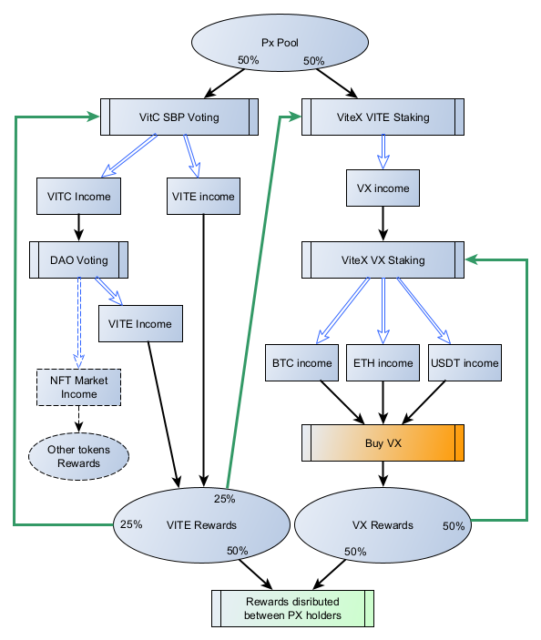

# Lightpaper 1.1
January 5th, 2022

## Beta warning
This is still very early, expect minor and possibly major changes.
It's about third major incarnation of the whitepaper so far, but it get's better every time!

## Vite Ecosystem overview
Vite is a next-generation high-throughput, low-latency, and highly-scalable network. Vite uses a Directed Acyclic Graph (DAG) ledger structure, which enables fast and feeless transactions of Vite coins and tokens created within its network. Vite's DAG structure is much more "green" (energy efficient) compared to many other cryptocurrencies.

Vite's team also develops and manages [ViteX](https://vitex.net/), a DEX app running on Vite blockchain. It is so tightly integrated with Vite Coin (VITE) that it's even a part of the official Vite Wallet apps. ViteX has it's own utility token, VX. VX is used to incentivize usage of the DEX in a different ways. Holders of the VX are eligible for rewards from a trading fees collected by ViteX. More information on ViteX and VX is awailable on [official site FAQ](https://vitex.net/faq).

## Opportunity
Px Team ("we") is heavily betting on [Vite Team](https://vite.org/) and ViteX DEX success. We think that specifically VX token is currently heavily undervalued. As the Vite ecosystem evolves and gets it's adoption of the built in DEX should also increase. That will drive exchange revenue up and so will VX holders rewards. Unlike VITE, VX have a fixed supply of 29,328,807.8 tokens with no inflation, so there is almost no non-catastrophic reasons for both token price and rewards to go down.

We see an opportunity in accumulating a substantial amount of VX, staking it and receiving BTC, ETH and USDT in rewards. Why it's important for amount of VX to be *substantial*? This is all about magic of a complex percent. The problem is that amount of each of BTC, ETH, USDT distributed each day is too small for instant reinvestment. Specifically the amount must be larger than minimum ViteX order value, so that BTC, ETH and USDT can be exchanged again for VX which can be reinvestment in stake. Daily reinvestment will give you a major advantage in a long run. But not only that. VX distribution is very limited in supply and time. Ever dropping VX distribution pool will end approximately in September 2027. So the sooner and faster you will start "mining" VX the more you will get. More to that, we can speculate that VX price will only grow in time as ViteX will grow in size. As a result VX holdings will become larger asset which is just nice to have! However even if it doesn't grow in price or even become less, it will still produce a nice income as dividends for you.

So Px idea is pretty simple:
1. Gather a large pool of VITE assets (large pool is required for daily reinvestment);
2. Invest pool assets;
3. Reinvest daily income;
4. Redistribute part of income between pool participants;
5. Final distribution *guarantees* initial investment returned, if you hold all the time (in VITE).
This is an asset management system in one of it's simple forms.

## Values
### Pragmatic (anti-hype) and safe
Px has nothing to do with hype. This token will not (probably) "moon" you anywhere. Don't expect daily news. It's about getting sustainable income with a "magic" of complex percent. Needless to say Px Team prefer a "safe-bet" type investments.

### Community natural growth
Naturally related to previous one. We don't force or proactively incentivize anyone to purchase Px tokens. This ideally should be DYOR type decision for a like-minded people.

### Crypto knowledge sharing and learning 
We encourage holders to share knowledge and discuss investments opportunities in crypto space. While we already have a strategy in place for funds distribution we are open to new ideas and opportunities.

## Tokenomics
### Supply
The initial and total supply of Px is 100,000,000 (100M) tokens. This makes it easy calculating your share: owning 1,000,000 (1M) tokens grants you 1% of the profit distribution share.
Burning of tokens is not planned and prohibited for everyone except the team.

### Distribution
All tokens will be distributed during presale.
The team part covers all additional expenses should they ever come from own assets.
If the team members decide to have a share in the project they are free to participate on everyone else's terms (i.e. either through presale or later by buying tokens exchange).

### Reinvestment
Target amount planned for reinvestment: 50%.

### Dividends
Dividends are paid on daily basis similar to how SBP is paid. For now they are currently planned to be paid in VITE and VX.

### Initial investment strategy
Below is investment strategy which is planned to be initially implemented by the project:

### Team incentivize points
Team receives 25% of final distribution *rewards* (doesn't include initial PX Pool staking funds).
Also team receives rewards from ViteX "mining" activities (operations wallet will use team invitation code).

## Roadmap (Project phases)
### 0. Preparation (~ Q1-Q3 2022)
1. Project technical tasks solutions finalized. The team must have a robust solution for rewards calculation and distribution;
2. Community communication and project promotion;
3. Whitepaper discussion and finalization of terms.

### 1. Distribution (~ Q2-Q4 2022)
The distribution will be performed in 2 ways:
1. Large investors (1M PX or more) presale (sale window TBD);
2. Sell of the remaining tokens on ViteX exchange.
Obviously by the time of ViteX distribution project will be listed on ViteX.
Planned distribution price (any stage) is 0.1 VITE, but this is not settled yet. That price will result in 10M VITE market cap value. Working with an assets below that seems less practicaly reasonable (as we want to reach daily reinvestment phase fast). 

### 2. Growth (~ 2022-2027)
Now then we have full pool (hopefully) at our disposal, we can make strategic decisions on investments and enjoy "snowball" effect.

### 3. Project termination (~ 2027)
Team receives it's share final distribution *rewards* (doesn't include initial PX Pool staking funds).
Remaining token rewards and initial PX Pool funds will be distributed proportionally to the PX share.
After that Px token will have no practical value.

# Project summary
- Px is an asset management project;
- Px is focused on safe investments in core Vite ecosystem token VX and VITE coin;
- Px have a clearly defined lifecycle of about 5 years;
- Px success is dependent on Vite ecosystem success, we bet on Vite and ViteX;
- Px team is incentivized by cumulative rewards generated.
